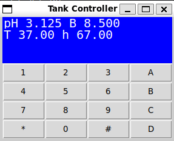

# Tank Controller in Python

<!-- ALL-CONTRIBUTORS-BADGE:START - Do not remove or modify this section -->

[](#contributors-)

<!-- ALL-CONTRIBUTORS-BADGE:END -->

## Project Motivation

The goal of this project is to migrate the original **TankController** software from **C++** to **Python** and run it on a **Raspberry Pi Pico**.

---

### Getting Started

Before getting started, install the following:

- **Python 3.14+**
- **uv** — Python package manager
  <https://docs.astral.sh/uv/>
- **Visual Studio Code**
  <https://code.visualstudio.com/>
- **Tkinter** — required for the local GUI
  Verify that Tkinter is installed by running:

```bash
python -m tkinter
```

If Tkinter is installed correctly, a small GUI window will appear.

#### macOS

If Tkinter is not already installed, install it with:

```bash
brew install python-tk@3.14
```

---

#### Step 2 — Fork or Clone the Repository

You can either fork the repository to your own GitHub account or clone it directly.

To clone the repository, open a Visual Studio Code Terminal and run:

```bash
git clone https://github.com/Open-Acidification/TankControllerPico.git
cd TankControllerPico
```

Make sure the project is saved on your local computer.

---

#### Step 3 — Open the Visual Studio Code Terminal and Run the Project

In Visual Studio Code, open the integrated terminal by navigating to:

**Terminal → New Terminal**
Then, use the script for your operating system:

##### Windows

```powershell
.\run_gui.bat
```

##### macOS / Linux

```bash
./run_gui.sh
```

If the setup was successful, the TankController GUI should open and look similar to the example below.



### Features

| View Commands    | Set Commands     |
| ---------------- | ---------------- |
| View IP and MAC  | pH calibration   |
| View free memory | Clear pH calibra |
| View Google mins | Clear Temp calib |
| View log file    | Set chill/heat   |
| View pH slope    | Set Google mins  |
| View PID         | Set KD           |
| View tank ID     | Set KI           |
| View temp cal    | Set KP           |
| View time        | Set pH target    |
| View version     | Set pH w sine    |
|                  | Set Temp w sine  |
|                  | PID on/off       |
|                  | Set Tank ID      |
|                  | Temp calibration |
|                  | Set temperature  |
|                  | Set date/time    |

### Testing

To perform Pytest tests for the devices and UI states.

 macOS / Linux

```bash
./test.sh
```

Window

```powershell
.\test.bat
```

## Contributors ✨

Thanks goes to these wonderful people ([emoji key](https://allcontributors.org/docs/en/emoji-key)):

<!-- ALL-CONTRIBUTORS-LIST:START - Do not remove or modify this section -->
<!-- prettier-ignore-start -->
<!-- markdownlint-disable -->
<table>
  <tbody>
    <tr>
      <td align="center" valign="top" width="14.28%"><a href="https://www.linkedin.com/in/kadensukachevin/"><br /><sub><b>Kaden Sukachevin</b></sub></a><br /><a href="https://github.com/Open-Acidification/TankControllerPico/commits?author=kadensu" title="Code">💻</a> <a href="https://github.com/Open-Acidification/TankControllerPico/commits?author=kadensu" title="Documentation">📖</a> <a href="https://github.com/Open-Acidification/TankControllerPico/issues?q=author%3Akadensu" title="Bug reports">🐛</a></td>
      <td align="center" valign="top" width="14.28%"><a href="https://github.com/prestoncarman"><br /><sub><b>Preston Carman</b></sub></a><br /><a href="https://github.com/Open-Acidification/TankControllerPico/commits?author=prestoncarman" title="Code">💻</a> <a href="https://github.com/Open-Acidification/TankControllerPico/issues?q=author%3Aprestoncarman" title="Bug reports">🐛</a></td>
      <td align="center" valign="top" width="14.28%"><a href="https://github.com/KonradMcClure"><br /><sub><b>Konrad McClure</b></sub></a><br /><a href="https://github.com/Open-Acidification/TankControllerPico/commits?author=KonradMcClure" title="Code">💻</a></td>
      <td align="center" valign="top" width="14.28%"><a href="https://github.com/Noah-Griffith"><br /><sub><b>Noah-Griffith</b></sub></a><br /><a href="https://github.com/Open-Acidification/TankControllerPico/commits?author=Noah-Griffith" title="Code">💻</a></td>
      <td align="center" valign="top" width="14.28%"><a href="https://github.com/d-cryptic"><br /><sub><b>Barun Debnath</b></sub></a><br /><a href="https://github.com/Open-Acidification/TankControllerPico/commits?author=d-cryptic" title="Code">💻</a></td>
      <td align="center" valign="top" width="14.28%"><a href="https://kieransukachevin.github.io/first%20portfolio/portfolio.html"><br /><sub><b>Kieran Sukachevin</b></sub></a><br /><a href="https://github.com/Open-Acidification/TankControllerPico/commits?author=kieransukachevin" title="Tests">⚠️</a> <a href="https://github.com/Open-Acidification/TankControllerPico/commits?author=kieransukachevin" title="Code">💻</a></td>
      <td align="center" valign="top" width="14.28%"><a href="https://github.com/jsoref"><br /><sub><b>Josh Soref</b></sub></a><br /><a href="https://github.com/Open-Acidification/TankControllerPico/commits?author=jsoref" title="Code">💻</a></td>
    </tr>
    <tr>
      <td align="center" valign="top" width="14.28%"><a href="https://github.com/TaylorSmith28"><br /><sub><b>TaylorSmith28</b></sub></a><br /><a href="https://github.com/Open-Acidification/TankControllerPico/commits?author=TaylorSmith28" title="Tests">⚠️</a> <a href="https://github.com/Open-Acidification/TankControllerPico/commits?author=TaylorSmith28" title="Code">💻</a></td>
      <td align="center" valign="top" width="14.28%"><a href="https://github.com/samuelnguyen999"><br /><sub><b>Samuel Nguyen</b></sub></a><br /><a href="https://github.com/Open-Acidification/TankControllerPico/commits?author=samuelnguyen999" title="Code">💻</a></td>
    </tr>
  </tbody>
</table>

<!-- markdownlint-restore -->
<!-- prettier-ignore-end -->

<!-- ALL-CONTRIBUTORS-LIST:END -->

This project follows the [all-contributors](https://github.com/all-contributors/all-contributors) specification. Contributions of any kind welcome!
